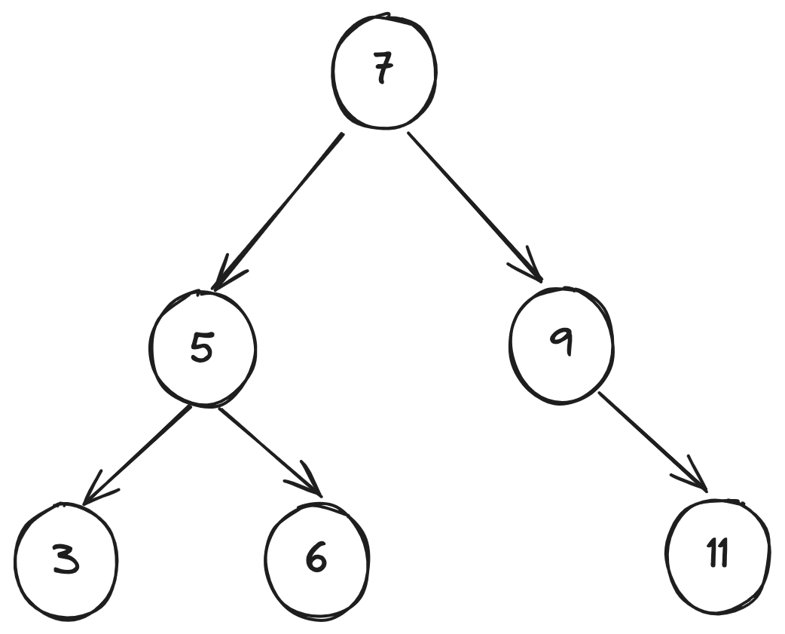
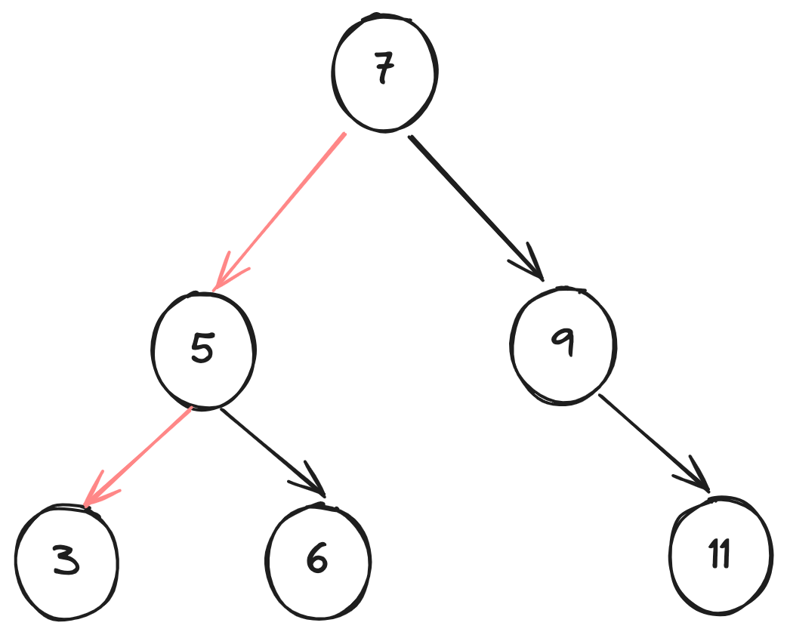
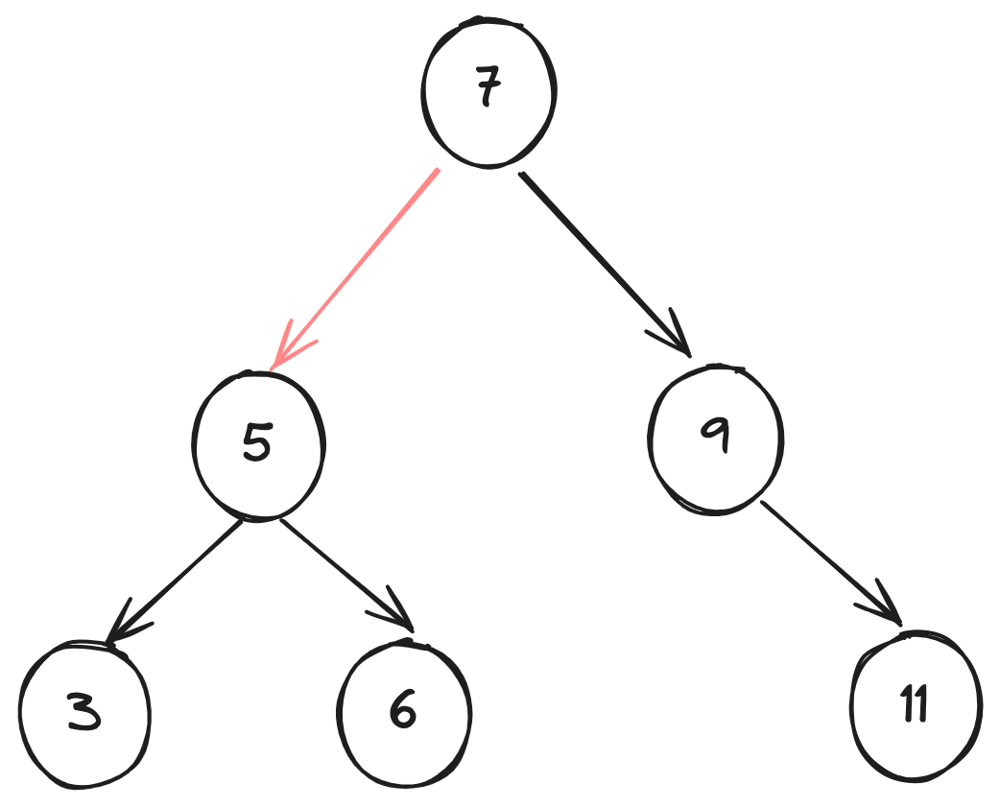
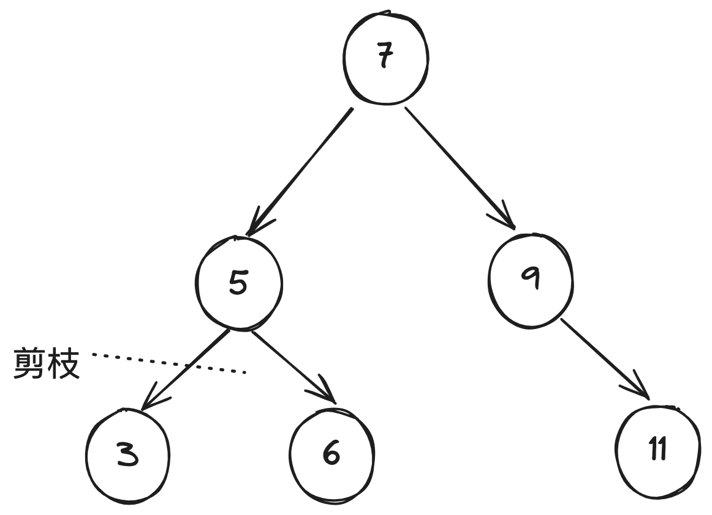

# 回溯算法

回溯算法是一种用于寻找所有（或部分）解的一种算法。它通过逐步构建解决方案，并在发现部分解决方案不能通向最终解时回退（即“回溯”），尝试其他可能的路径。

以下是回溯算法的基本思想和步骤：

## 基本思想

回溯算法通常采用深度优先搜索来遍历解决问题。在每一步选择中，尝试每一种可能的选择，当发现某个选择不能得到有效解时，回退到上一步，尝试其他选择。

## 算法步骤

1. **选择路径**：在当前步骤选择一个可能的选择。
2. **剪枝判断**：检查当前选择是否满足问题的约束条件。如果不满足，则放弃当前选择（即剪枝）。
3. **递归处理**：若当前选择满足条件，则继续递归处理下一个步骤。
4. **回溯**：若通过当前选择不能得到解，撤销选择并返回上一步，尝试其他选择。

## 常用术语

| 名词                     | 定义                                                               |
|--------------------------|--------------------------------------------------------------------|
| 解（solution）           | 解是满足问题特定条件的答案，可能有一个或多个                       |
| 约束条件（constraint）   | 约束条件是问题中限制解的可行性的条件，通常用于剪枝                 |
| 状态（state）            | 状态表示问题在某一时刻的情况，包括已经做出的选择                   |
| 尝试（attempt）          | 尝试是根据可用选择来探索解空间的过程，包括做出选择，更新状态，检查是否为解 |
| 回退（backtracking）     | 回退指遇到不满足约束条件的状态时，撤销前面做出的选择，回到上一个状态 |
| 剪枝（pruning）          | 剪枝是根据问题特性和约束条件避免无意义的搜索路径的方法，可提高搜索效率 |

## 举个例子 🌰

下面用二叉搜索树来举个例子

### 回退

**场景**：需要记录树节点值为奇数的节点。

在这个过程中，很明显是需要对整个树遍历的，在这个过程中，就会涉及到回退。

比如，我们通过中序遍历已经遍历到 3 节点了

这个时候，我们进行会退到 5 节点, 其实这里也算回溯。

### 剪枝

**场景**：需要记录树节点值为大于 5 的节点。

在这个过程中，我们使用前序遍历，同时，我们这里是一个二叉搜索树。
这里，遍历到 5 了之后，我们可以把 5 进行剪枝操作。

## 优点与局限性

回溯算法本质上是一种**深度优先搜索算法**，它尝试所有可能的解决方案直到找到满足条件的解。这种方法的优点在于能够找到所有可能的解决方案，而且**在合理的剪枝操作下，具有很高的效率**。

然而，**在处理大规模或者复杂问题时，回溯算法的运行效率可能难以接受**。

- **时间**：回溯算法通常需要遍历状态空间的所有可能，时间复杂度可以达到指数阶或阶乘阶。
- **空间**：在递归调用中需要保存当前的状态（例如路径、用于剪枝的辅助变量等），当深度很大时，空间需求可能会变得很大。

即便如此，**回溯算法仍然是某些搜索问题和约束满足问题的最佳解决方案**。对于这些问题，由于无法预测哪些选择可生成有效的解，因此我们必须对所有可能的选择进行遍历。在这种情况下，关键是如何优化效率，常见的效率优化方法有两种。

- **剪枝**：避免搜索那些肯定不会产生解的路径，从而节省时间和空间。
- **启发式搜索**：在搜索过程中引入一些策略或者估计值，从而优先搜索最有可能产生有效解的路径。

## 回溯算法应用

回溯算法可用于解决许多搜索问题、约束满足问题和组合优化问题。如**搜索问题、约束满足问题、组合优化问题**。

## 参考链接
- [回溯算法](https://www.hello-algo.com/chapter_backtracking/backtracking_algorithm/#1315)