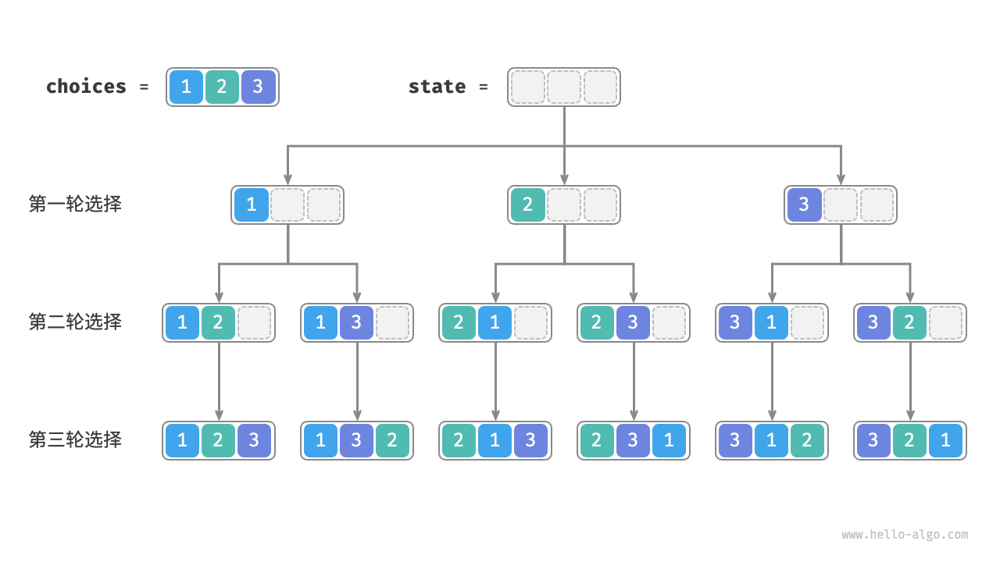
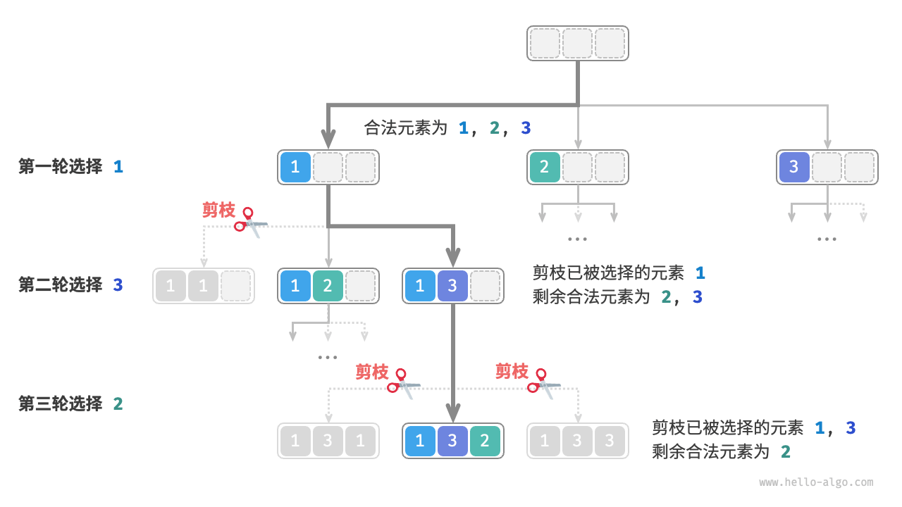

# 全排列问题

全排列问题是一个经典的组合数学和算法问题。它的目标是生成给定集合的所有可能排列。理解全排列问题需要掌握以下几个关键点：

通常我们采用回溯的方法来进行实现。

全排列举个例子：

| 输入数组 | 所有排列                                 |
| -------- | ---------------------------------------- |
| [1]      | [1]                                      |
| [1, 2]   | [1, 2], [2, 1]                           |
| [1, 2, 3]| [1, 2, 3], [1, 3, 2], [2, 1, 3], [2, 3, 1], [3, 1, 2], [3, 2, 1] |


## 实现步骤

全排序，其实本质上我们是进行选择，假设我们的数据长度为 n, 并且这个数组没有重复元素，我们本质上是做 `n` 次选择。



如上图，我们其实可以看到，其实一共有 n^2 的选择。但这里有一个点，我们这里选择的元素其实不再进行选择，于是这里就涉及到了**剪枝**。

### 重复选择剪枝

我们需要记录下那些元素选择过了，我们后续遇到这些元素就直接跳过就行了。如下图



同时，我们可以看出，一共有 n * (n - 1) * (n - 2) * ... * 1 的选择。
所以我们的搜索空间大小从 **O(n^n) -> O(n!)** 。

## 实现代码

```ts
function backtrack(
  state: number[],
  choices: number[],
  selected: boolean[],
  res: number[][]
): void {
  if(state.length === choices.length) {
    res.push([...state])
  }

  choices.forEach((choice, i) => {
    if(selected[i]) {
      return;
    }

    selected[i] = true;
    state.push(choice);
    backtrack(state, choices, selected, res);
    selected[i] = false;
    state.pop();
  })
}


function permutationsI(nums: number[]): number[][] {
  const res: number[][] = [];
  backtrack([], nums, Array(nums.length).fill(false), res);
  return res;
}
```

## 参考

- [Hello 算法](https://www.hello-algo.com/chapter_backtracking/permutations_problem/)