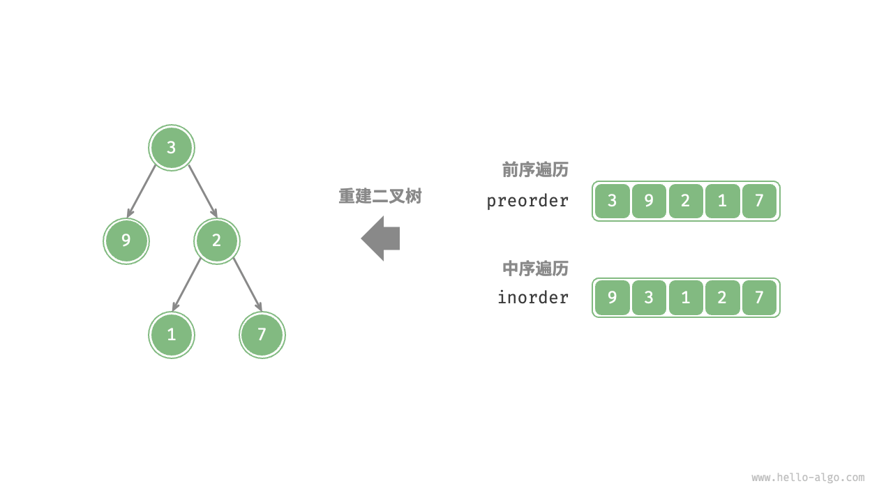
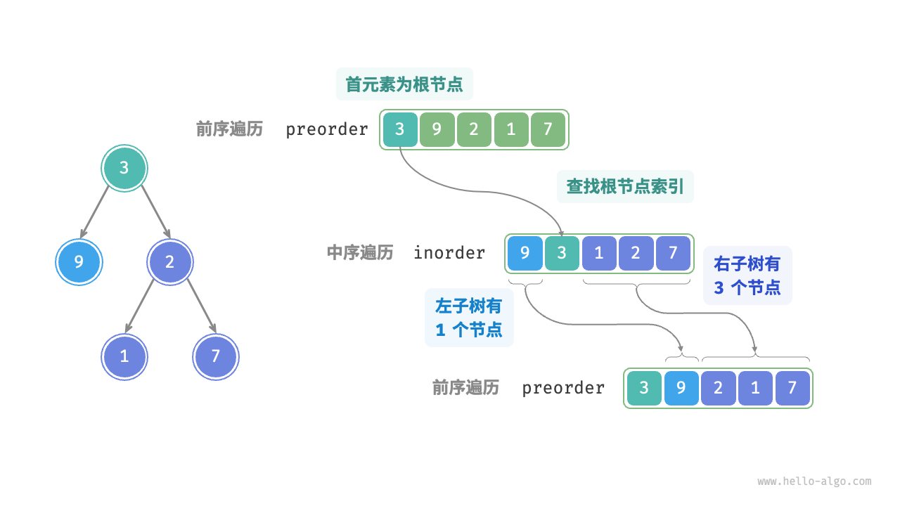
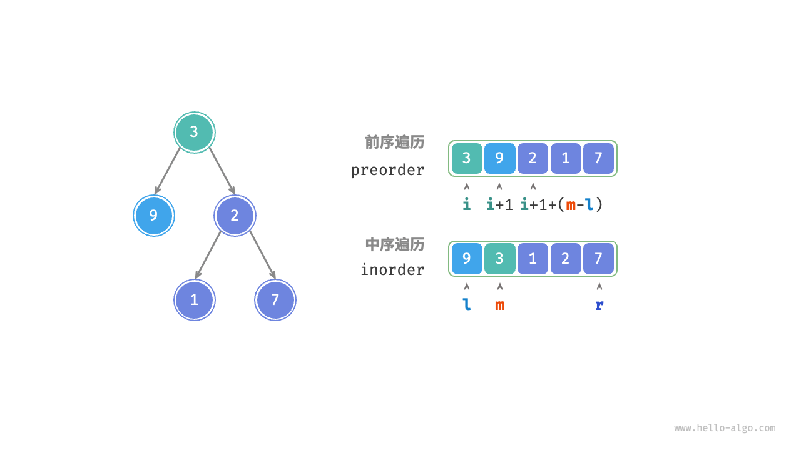

# 构建二叉树

这里再具体举一个分治的例子，就是**构建二叉树**。

描述：通过 **前序遍历(preOrder)** 和 **中序遍历(inOrder)**，请从中构建二叉树，返回二叉树的根节点。



## 判断是否为分治问题

原问题定义为从 preorder 和 inorder 构建二叉树，是一个典型的分治问题。

- **问题可以分解**：从分治的角度切入，我们可以将原问题划分为两个子问题：构建左子树、构建右子树，加上一步操作：初始化根节点。而对于每棵子树（子问题），我们仍然可以复用以上划分方法，将其划分为更小的子树（子问题），直至达到最小子问题（空子树）时终止。
  
- **子问题是独立的**：左子树和右子树是相互独立的，它们之间没有交集。在构建左子树时，我们只需关注中序遍历和前序遍历中与左子树对应的部分。右子树同理。
  
- **子问题的解可以合并**：一旦得到了左子树和右子树（子问题的解），我们就可以将它们链接到根节点上，得到原问题的解。

## 如何划分子树

根据以上分析，这道题可以使用分治来求解，但如何通过前序遍历 `preorder` 和中序遍历 `inorder` 来划分左子树和右子树呢？

根据定义，`preorder` 和 `inorder` 都可以划分为三个部分。

- **前序遍历**：[ 根节点 | 左子树 | 右子树 ] ，例如图 12-5 的树对应 [ 3 | 9 | 2 1 7 ] 。
- **中序遍历**：[ 左子树 | 根节点 ｜ 右子树 ] ，例如图 12-5 的树对应 [ 9 | 3 | 1 2 7 ] 。
以上图数据为例，我们可以通过图 12-6 所示的步骤得到划分结果。

1. 前序遍历的首元素 3 是根节点的值。
2. 查找根节点 3 在 inorder 中的索引，利用该索引可将 inorder 划分为 [ 9 | 3 ｜ 1 2 7 ] 。
3. 根据 inorder 的划分结果，易得左子树和右子树的节点数量分别为 1 和 3 ，从而可将 preorder 划分为 [ 3 | 9 | 2 1 7 ] 。
   


## 基于变量描述子树区间

根据以上划分方法，我们已经得到根节点、左子树、右子树在 preorder 和 inorder 中的索引区间。而为了描述这些索引区间，我们需要借助几个指针变量。

- 将当前树的根节点在 preorder 中的索引记为 i。
- 将当前树的根节点在 inorder 中的索引记为 m。
- 将当前树在 inorder 中的索引区间记为 l, r。

则有下方表格
| 根节点 | 在 preorder 中的索引 | 子树在 inorder 中的索引区间 |
|-------|-------------------|-----------------------------|
| 当前树 |i                | [l, r]                      |
| 左子树 |i + 1            | [l, m - 1]                  |
| 右子树 |i + 1 + (m - l)  | [m + 1, r]                  |

加一个图方便理解。



## 代码实现

```ts
function dfs(
  preorder: number[],
  inorderMap: Map<number, number>,
  i: number,
  l: number,
  r: number
): TreeNode | null {
  // 子树区间为空时终止
  if (r - l < 0) return null;
  // 初始化根节点
  const root: TreeNode = new TreeNode(preorder[i]);
  // 查询 m ，从而划分左右子树
  const m = inorderMap.get(preorder[i]);
  // 子问题：构建左子树
  root.left = dfs(preorder, inorderMap, i + 1, l, m - 1);
  // 子问题：构建右子树
  root.right = dfs(preorder, inorderMap, i + 1 + m - l, m + 1, r);
  // 返回根节点
  return root;
}

function buildTree(preorder: number[], inorder: number[]) {
  let inorderMap = new Map<number, number>();
  for (let i = 0; i < inorder.length; i++) {
    inorderMap.set(inorder[i], i);
  }
  const root = dfs(preorder, inorderMap, 0, 0, inorder.length - 1);
  return root;
}
```

时间复杂度为 O(n), 空间复杂度为 O(n).

## 参考

- [Hello 算法](https://www.hello-algo.com/chapter_divide_and_conquer/build_binary_tree_problem/)
