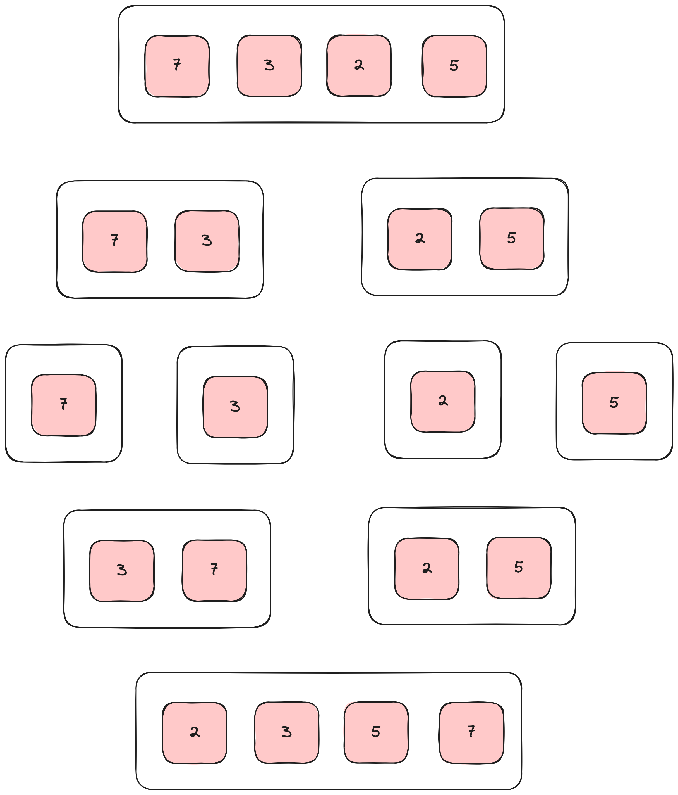

# 排序算法

分治，就是分而治之。核心思想是**将大的问题拆分成结构相似的小问题，递归解决这些小问题，最后将这些小问题进行合并，也就能得到最后的解了。**

分治算法的思想主要在于下方的三个步骤
- **分解（Divide）** ：将原问题分解为若干个规模较小的子问题。这些子问题应该是原问题的较小版本，并且它们之间相互独立。
- **解决（Conquer）** ：递归地解决这些子问题。如果子问题的规模足够小，可以直接解决（即到达递归的基准情况）。
- **合并（Combine）**：将子问题的解组合起来，形成原问题的解。

## 分治场景判断

什么情况下适合我们使用分治算法呢。具体如下。

1. **问题是否可以分解为相似的子问题** ：分治算法的核心思想是将一个大问题分解成若干个规模较小且结构相似的子问题。如果一个问题可以自然地分解为若干个类似的问题，那么它很可能适合用分治算法解决。例如，排序问题可以分解为对小部分数组进行排序，搜索问题可以分解为在数组的一部分中进行搜索。

2. **子问题是否独立** ：分治算法要求各个子问题相互独立，即一个子问题的解决不依赖于其他子问题的解决。如果子问题之间存在依赖关系，那么分治算法可能不适用。例如，在某些动态规划问题中，子问题之间的结果可能会互相影响，这时候分治策略就不合适。

3. **子问题的合并是否简单** ：解决了子问题之后，必须能有效地将它们的结果合并起来，得到原问题的解。如果合并子问题的过程非常复杂，甚至比解决原问题还要复杂，那么使用分治算法可能不太合适。合并过程的复杂度是判断分治算法是否合适的重要因素。例如，归并排序中合并两个有序数组的过程是简单且高效的。

4. **递归结束条件是否明确** ：分治算法通常通过递归来解决子问题，因此需要有明确的递归结束条件。当问题规模减小到某个程度时，可以直接得到结果，而不需要继续分解。例如，在归并排序中，当子数组的长度为1时，递归终止，因为一个长度为1的数组本身就是有序的。

所以其实我们可以主要就是以上这四点。

| 算法 | 分解 | 子问题独立性 | 合并 | 递归结束条件 |
| ---- | ---- | ------------ | ---- | ------------ |
| 归并排序 (Merge Sort) | 将数组分成两个子数组 | 两个子数组相互独立 | 合并两个有序子数组 | 子数组长度为1时停止 |
| 快速排序 (Quick Sort) | 选择枢轴，将数组分为两部分 | 两部分独立处理 | 自然合并，不需要额外操作 | 子数组长度为1时停止 |
| 二分查找 (Binary Search) | 将有序数组分为两部分 | 仅搜索一部分 | 没有合并步骤 | 找到目标元素或子数组为空 |
| Strassen矩阵乘法 | 将大矩阵分成若干小矩阵 | 各小矩阵独立相乘 | 合并小矩阵的乘积 | 矩阵规模足够小时直接相乘 |
| 最接近点对问题 | 将点集分为两个子集 | 分别求解两个子集内最近点对 | 处理跨子集的最近点对 | 点集规模足够小时使用暴力法 |

## 优缺点

### 优点

1. 简化问题：分治算法通过将复杂的问题分解为多个较小且相似的子问题，使得问题变得更易处理。例如，归并排序将排序问题分解为对两个子数组的排序问题。

2. 并行计算：分治算法的子问题通常是相互独立的，因此可以并行处理，从而提高计算效率。这在多处理器系统中尤为有用。

3. 递归思想：分治算法利用递归思想解决问题，代码通常较为简洁，逻辑清晰。例如，二分查找的递归实现非常简明。

4. 适用广泛：分治算法适用于许多类型的问题，包括排序、查找、矩阵乘法、几何问题等，具有广泛的应用范围。

5. 高效：在许多情况下，分治算法可以显著降低时间复杂度。例如，归并排序和快速排序的时间复杂度为 𝑂(𝑛log𝑛)，而普通的插入排序和冒泡排序的时间复杂度为 𝑂(𝑛2)。

### 缺点

1. 递归开销：分治算法通常通过递归实现，递归调用会带来额外的开销，包括函数调用的栈空间和时间消耗。如果递归层次较深，可能导致栈溢出。

2. 重复计算：某些分治算法可能会重复计算相同的子问题，从而影响效率。例如，在计算斐波那契数列时，简单的递归方法会大量重复计算相同的子问题。

3. 合并复杂度：在某些问题中，合并子问题的结果可能比较复杂，甚至比解决子问题本身更复杂，从而影响算法的整体效率。例如，在某些几何问题中，合并步骤可能涉及复杂的几何计算。

4. 空间复杂度：分治算法有时需要额外的空间来存储子问题的结果。例如，归并排序需要额外的数组空间来合并子数组，导致空间复杂度为 O(n)

## 具体应用

| 应用领域       | 具体算法                         | 描述                                                                         | 应用场景                        |
| -------------- | -------------------------------- | -------------------------------------------------------------------------- | ----------------------------- |
| 排序算法       | 归并排序（Merge Sort）            | 将数组分成两半，递归排序后合并                                               | 稳定排序场景，如外部排序       |
|                | 快速排序（Quick Sort）            | 选择枢轴，将数组分为两部分，递归排序两部分                                   | 系统库函数排序实现             |
| 搜索算法       | 二分查找（Binary Search）         | 在有序数组中反复缩小查找范围，直到找到目标值                                 | 大型有序数据集内快速查找      |
| 计算几何       | 最近点对问题（Closest Pair）      | 分成两部分，分别找出每部分内最近点对，合并考虑跨部分最近点对                 | 计算几何中寻找最近点对        |
|                | 凸包问题（Convex Hull）           | 使用分治法找出二维平面上一组点的凸包                                         | 计算几何中的最小边界多边形    |
| 动态规划优化   | 矩阵链乘法（Matrix Chain Multiplication） | 将矩阵链分成两个子链，递归计算子链的最小乘法次数，再合并                     | 优化矩阵链乘法计算顺序        |
|                | 最大子段和问题（Maximum Subarray） | 将数组分成两半，分别找出每一半的最大子段和，再考虑跨越两半的最大子段和       | 金融分析中的最大收益计算      |
| 数值算法       | 快速傅里叶变换（FFT）             | 将傅里叶变换分解为较小的傅里叶变换计算                                       | 信号处理、图像处理、音频处理  |
|                | Strassen矩阵乘法                 | 将矩阵乘法分解为较小的矩阵乘法，减少计算复杂度                               | 大规模矩阵运算                |
| 图算法         | 最小生成树（MST）                 | 某些MST算法（如Borůvka's algorithm）利用分治思想                             | 网络设计、VLSI设计             |
| 文本处理       | 最长公共子序列（LCS）             | 将字符串分成较小部分，递归计算LCS                                           | DNA序列比对、文件比较         |
| 其他应用       | 大整数乘法（Karatsuba算法）       | 将大整数乘法分解为较小的整数乘法计算                                         | 计算机科学中的大整数运算      |
|                | 汉诺塔问题（Tower of Hanoi）      | 将问题分解为较小的汉诺塔问题来解决                                           | 递归教学示例                  |
